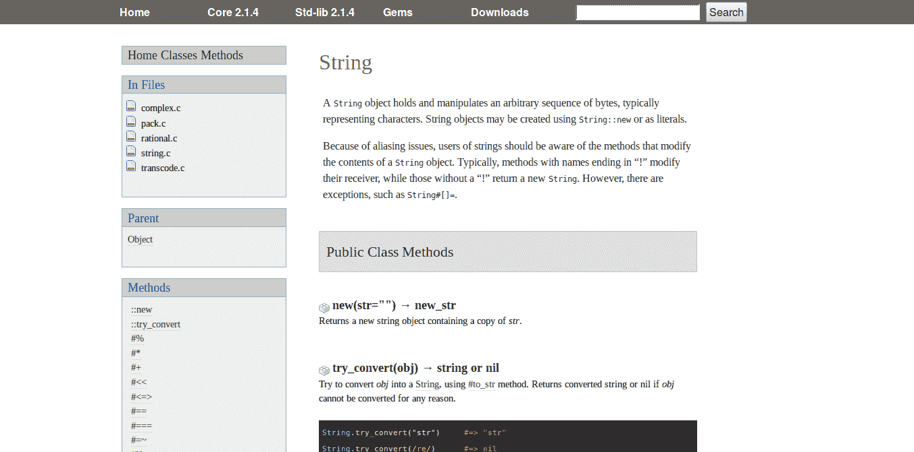

## 15\. Rdoc

您正在阅读本书是因为您正在寻找某种文档来开始使用 Ruby 进行编程。 文档在任何类型的编程中都非常重要。 为所编写的代码保留良好的文档记录可能会使您与优秀的程序员区分开来，并使您成为一个受追捧的人。 本章告诉您两件事，首先是 Ruby 的核心文档在哪里，以及如何查找和阅读它。 第二，它教您如何生成文档，以便其他人可以更好地理解您的程序。

### 15.1。 阅读 Ruby 文档

假设您想了解 Ruby 程序中的 String 类。 您想知道如何使用 Ruby 来计算姓名中的字符数，那么该怎么做呢？ 访问此链接 [http://ruby-doc.org/](http://ruby-doc.org/) ，这是可获取红宝石文档的集中位置。 现在，如果您可以进行一些操作，您会发现一个东西/链接，例如：2.1.4 core-Ruby 2.1.4 的 Core API 文档。 单击它，您将定向到此链接： [http://ruby-doc.org/core-2.1.4/](http://ruby-doc.org/core-2.1.4/) ，此处记录了 2.1.4 的核心库。

可能会出现一个问题，如何找出您使用的红宝石的版本？ 在终端类型 ruby -v 中，它将抛出如下输出：ruby 1.9.3p194（2012-04-20 修订版 35410）[x86_64-linux]，请查看突出显示的代码段，这告诉我我正在使用 ruby 1.9.3 分 194。 谁在乎 p194 是什么？ 我知道我使用的是 ruby 1.9.3，所以我要看它的文档！

好的，在 [http://ruby-doc.org/core-2.5.1/](http://ruby-doc.org/core-2.5.1/) 中，您需要浏览 String，如果这样做，您会找到以下链接： [http：// ruby​​- doc.org/core-2.5.1/String.html](http://ruby-doc.org/core-2.5.1/String.html) ，这是 String 类文档所在的位置。 您可以通过很长的时间（几乎涵盖所有内容）或在顶部搜索栏中键入 String 来获得此文档，在这种情况下，Rdoc 将显示有效的搜索结果。

下图显示我通过在标有 Classes 的文本框中键入 Sting 来过滤 Ruby 中的类。 这将帮助我轻松过滤结果/类。



好的，然后，如果您安装正确，请单击字符串将您带到此处 [http://ruby-doc.org/core-2.2.2/String.html](http://ruby-doc.org/core-2.2.2/String.html) 并向下浏览，您会找到 称为#length 的东西，当单击时会滚动到此处 [http://ruby-doc.org/core-2.2.2/String.html#method-i-length](http://ruby-doc.org/core-2.2.2/String.html#method-i-length) ，所以它确实说我们有东西 /函数/方法称为长度，另一项称为大小。

通过有根据的猜测，我们必须能够知道这就是字符串长度的原因，让我们在 irb 上进行尝试

```
$ irb --simple-prompt
>> "Karthikeyan A K".length
=> 15
>> "Karthikeyan A K".size
=> 15
```

这样就行了！ 基本的事情是到达 [http://ruby-doc.org/](http://ruby-doc.org/) 并打破头脑，这将使事情发展，并使您开始了解阅读 Ruby 文档。

### 15.2。 建立文件

因此，无论您希望还是希望，您可能会或可能不知道阅读 ruby 的文档。 让我们看看如何创建一个。 确定，在名为 [rdoc_square.rb](code/rdoc_square.rb) 的文档中键入以下代码，或使用您喜欢的任何名称。 为简单起见，将其放入文件夹，并确保该文件夹中没有其他文件。

```
#rdoc_square.rb

# This class Square takes in side_length (of type float or fixnum)
# as argument
class Square

  # The length of a square's side
  attr_accessor :side_length

  # Retuns the area of the square
  def area
    @side_length * @side_length
  end

  # Returns perimeter of the square
  def perimeter
    4 * @side_length
  end
end
```

请注意，我是如何在属性和功能之前添加注释 &lt;sup class="footnote"&gt;[ [36](#_footnotedef_36 "View footnote.") ]&lt;/sup&gt; 的。 现在，导航到 [rdoc_square.rb](code/rdoc_square.rb) 所在的文件夹（使用控制台/终端），然后键入此命令`rdoc`，就是这样，神奇的事情发生了。 您会发现创建了一个名为 doc 的文件夹，只需导航到该文件夹​​并打开名为 index.html 的文件，然后可以单击 Classs and Modules Index 框中的 Square 链接即可获得一个漂亮的文档，如图所示。


在上图中的“属性”部分中，您可以看到 side_length 属性的文档，正下方显示的是它的文档，其读取正方形边的长度。 现在检查代码 [rdoc_example.rb](code/rdoc_example.rb) 检查以下两行

```
class Square

        # The length of a square's side
        attr_accessor :side_length
…....
end
```

我们刚刚在文档页面上的`attr_accessor :side_length`之前添加了一条注释行。 这样，rdoc 决定要放置什么文档。 它只是检查在声明类，变量和函数定义之前发生了什么注释，并将其放入文档中，将其整齐地打包，放入漂亮的 CSS（即样式）和 Javascript（即动态效果&lt;sup class="footnote"&gt;） [ [37](#_footnotedef_37 "View footnote.") ]&lt;/sup&gt; ），并准备将其提供给您参考。 您可以将代码以及 doc 文件夹分发给其他人以供参考，这样人们就可以更好地了解您的代码，而无需遍历所有的 ruby 编码。

这些是生成文档的步骤

*   将注释的红宝石文件放入文件夹

*   通过终端导航到该文件夹​​，然后键入 rdoc

*   您将看到一个名为 doc 的文件夹已创建，只需进入该文件夹并启动文件 index.html