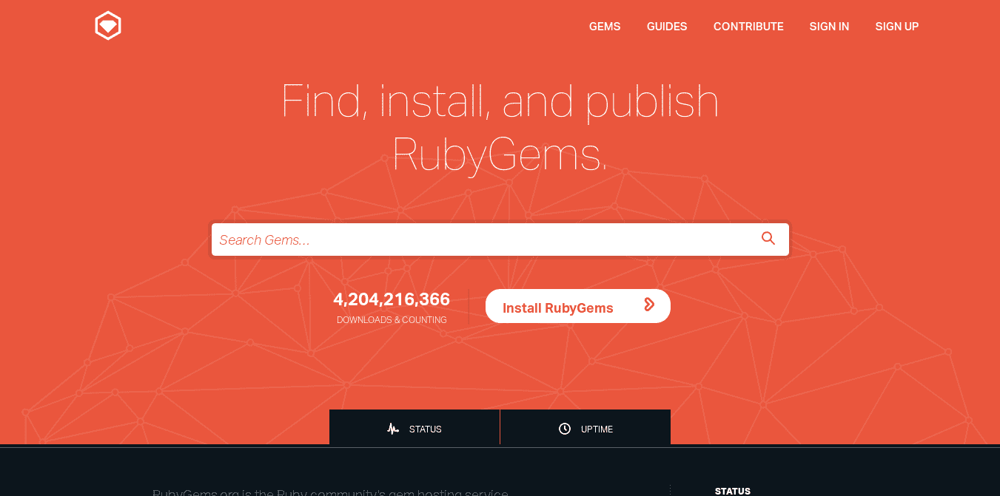
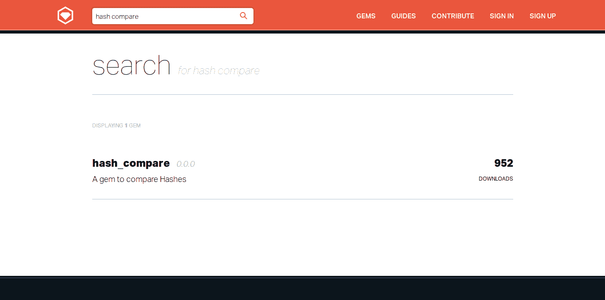
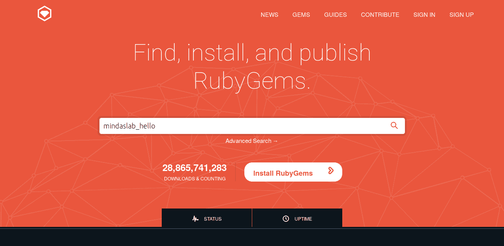

## 24.宝石

宝石是红宝石的包装管理材料。 例如，您可能想用红宝石做某事，例如说比较两个哈希，而不是自己编写代码，而是可以搜索位于 [http://rubygems.org](http://rubygems.org) 的 ruby gems 存储库。

### 24.1。 搜索宝石

因此，让我们比较两个哈希。 有一个称为 hash_compare 的 gem，用于比较散列。 现在，您可以转到 [http://rubygems.org](http://rubygems.org) 并搜索“哈希比较”，而无需使用双引号



您将获得一个如下所示的页面，单击“哈希比较”链接，您将被定向到此页面。 [https://rubygems.org/gems/hash_compare](https://rubygems.org/gems/hash_compare)



这就是您搜索宝石的方式。 相反，如果您搜索确切的宝石名称 hash_compare，则 [http://rubygems.org](http://rubygems.org) 现在变得很聪明，可以直接进入宝石页面。

### 24.2。 安装宝石

现在，您已经找到了 gem，如何安装它？ 如果您位于 gems 页面，则在这种情况下， [https://rubygems.org/gems/hash_compare](https://rubygems.org/gems/hash_compare) ，您将获得将其安装到计算机上的说明。 您可以通过键入以下命令来安装 hash_compare gem

```
$ gem install hash_compare
```

这将吐出以下内容，表明它已安装

```
Fetching: hash_compare-0.0.0.gem (100%)
Successfully installed hash_compare-0.0.0
1 gem installed
Installing ri documentation for hash_compare-0.0.0...
Installing RDoc documentation for hash_compare-0.0.0...
```

也就是说，在终端中键入`gem install gem_name`应该可以毫无问题地安装大多数宝石。

### 24.3。 查看文件

因此，您已经成功安装了 gem，现在您必须知道如何使用它，在其他地方，除了学习其文档之外，还是学习红宝石代码的好地方。 如果不确定 rdoc 或 ruby 文档，请阅读 [Rdoc](#_rdoc) 一章。 要查看已安装的 gem 的文档，您需要启动一个叫做 gem server 的东西，可以通过在终端中键入以下命令来实现

```
$ gem server
Server started at http://0.0.0.0:8808
```

上面的命令将显示一个输出，表明服务器已启动。 要了解有关哈希的信息，请在浏览器中将 gem 转到此地址 [http://0.0.0.0:8808](http://0.0.0.0:8808) 并搜索 hash_compare，否则，如果需要更短的方法，请单击此链接 [http：/ /0.0.0.0:8808/#hash_compare](http://0.0.0.0:8808/#hash_compare) ，当您单击 hash_compare 时，您将被引导到此处 [http://0.0.0.0:8808/doc_root/hash_compare-0.0.0/rdoc/index.html [](http://0.0.0.0:8808/doc_root/hash_compare-0.0.0/rdoc/index.html) ，这是 hash_compare gem 的文档页面。

在该页面上，您将具有关于 hash_compare gem 的足够（可能）详细信息。

### 24.4。 使用宝石

OK，要使用宝石 &lt;sup class="footnote"&gt;[ [58](#_footnotedef_58 "View footnote.") ]&lt;/sup&gt; ，我们在终端中使用以下命令登录到 irb

```
$ irb --simple-prompt
```

接下来，我们将需要使用以下命令的哈希比较命令

```
>> require 'hash_compare'
=> true
```

由于安装了宝石，因此显示`true`。 现在让我们构建两个哈希 a，如下所示

```
>> a = { a: 1, b: 2}
=> {:a=>1, :b=>2}
>> b = { a: 1, b: 3, c: 2}
=> {:a=>1, :b=>3, :c=>2}
```

现在我们将它们添加到 hash_compare 对象

```
>> h = HashCompare.new a, b
```

并使用新添加的功能查找新添加的内容，如下所示

```
>> h.newly_added
=> {:c=>2}
```

好吧，就是这样。 您已经了解了如何使用宝石。

### 24.5。 宝石文件

您一定听说过 Ruby gems，即将创建它并将其发布在 [http://rubygems.org](http://rubygems.org) 上。 现在让我们看看 Gemfile 的用途。

检出这些文件：

第一个叫做 requester.rb

```
# requester.rb

require 'rubygems'
require 'bundler/setup'
Bundler.require(:default)

resource = RestClient::Resource.new 'http://nothing.com'
p resource.get
```

第二个是 Gemfile，具有以下内容

```
source 'https://rubygems.org'

gem 'rest-client'
```

将它们放在同一文件夹中。 如果查看 requester.rb，它将使用以下几行将请求发送到 [http://nothing.com](http://nothing.com) ：resource = RestClient :: Resource.new'http://nothing.com'

```
p resource.get
```

并打印出来。 为此，我们需要使用以下命令安装一个名为 rest-client 的 gem

```
$ gem install rest-client
```

我们需要使用以下行将其要求为 requester.rb

```
require 'rest-client'
```

换句话说，代码必须如下所示

```
require 'rest-client'

resource = RestClient::Resource.new 'http://nothing.com'

p resource.get
```

那么为什么我们有这三行

```
require 'rubygems'
require 'bundler/setup'
Bundler.require(:default)
```

而不是一个？ 好吧，让我解释一下。 首先，这是一个简单的项目，只需要一颗宝石，实际上，在现实生活中我们可能需要数十个宝石。 在运行项目之前，如果系统中没有这些 gems，则需要手动检查每个 gem 是否存在并安装。 对于少量宝石来说，这可能很简单，但事实是，如果我们有很多宝石，我们会讨厌它。

欢迎使用 Ruby，这是 Gemfile 的救星。 让我们分析一下。 打开 Gemfile，第一行是

```
source 'https://rubygems.org'
```

这告诉捆绑程序（获取和安装宝石的东西）必须从何处获取宝石。 几乎所有红宝石宝石都以 [http://rubygems.org](http://rubygems.org) 结尾。 但是有些坏人喜欢拥有专有代码并且不公开发布。 那些吸盘让它们自己保存，对他们来说将有所不同。

接下来，我们逐一列出该格式所需的宝石 gem“ &lt; gem-name &gt;”。 在这种情况下，我们只有一个宝石，因此我们将其列为

```
gem 'rest-client'
```

接下来，在需要这些宝石的 ruby 程序中，我们将这段代码放在顶部

```
require 'rubygems'
require 'bundler/setup'
Bundler.require(:default)
```

我不知道它到底能做什么，但是这会加载 Gemfile 中指定的所有 gem，从而使我们运行程序所需的所有 gem 都可以使用。 如果将来我能学到更多，可能会更新此部分，或者可能不会更新。 将所有 gem 提取并安装到系统中所需要做的就是在终端中键入以下内容：

```
$ bundle install
```

或总之

```
$ bundle
```

而已。 最新版本的所有 gems 都将安装在您的系统中，并且可用于需要它的程序 &lt;sup class="footnote"&gt;[ [59](#_footnotedef_59 "View footnote.") ]&lt;/sup&gt; 。 享受生活！

#### 24.5.1。 Gemfile.lock

如果查看 [Gemfile](code/fetch_data/Gemfile) ，则只给出`gem 'rest-client'`，但请看下面所示的 [Gemfile.lock](code/fetch_data/Gemfile.lock) 。 它包含很多东西。 这是什么 Gemfile.lock。

好吧，它的简单`rest-client`并不是独立的 Ruby 包（又名宝石），它依赖于其他宝石。 Gemfile.lock 列出了我们使用`bundle`命令时安装的所有 gem。 让我们分析如下所示的 Gemfile.lock

```
 ```
1
2
3
4
5
6
7
8
9
10
11
12
13
14
15
16
17
18
19
20
21
22
23
24
25
26
27

```

 |

```
GEM
  remote: https://rubygems.org/
  specs:
    domain_name (0.5.20180417)
      unf (&gt;= 0.0.5, &lt; 1.0.0)
    http-cookie (1.0.3)
      domain_name (~&gt; 0.5)
    mime-types (3.2.2)
      mime-types-data (~&gt; 3.2015)
    mime-types-data (3.2018.0812)
    netrc (0.11.0)
    rest-client (2.0.2)
      http-cookie (&gt;= 1.0.2, &lt; 2.0)
      mime-types (&gt;= 1.16, &lt; 4.0)
      netrc (~&gt; 0.8)
    unf (0.1.4)
      unf_ext
    unf_ext (0.0.7.5)

PLATFORMS
  ruby

DEPENDENCIES
  rest-client

BUNDLED WITH
   1.16.2
```

 | 
```

因此，它以关键字`GEM`开头，在该关键字下列出了所有已安装的 gem。 检出第 2 行，它说`remote: [https://rubygems.org/](https://rubygems.org/)`，如果您还记得在 Gemfile 中输入了`source 'https://rubygems.org'`，则会将其记录为锁定文件中的远程存储库。

检出这些行（20 & 21）

```
PLATFORMS
  ruby
```

在此定义平台。 本书重点介绍的是 YARV &lt;sup class="footnote"&gt;[ [60](#_footnotedef_60 "View footnote.") ]&lt;/sup&gt; ，它是默认的红宝石解释器，但不是唯一的。 还有其他解释器，例如运行 Java 的 JRuby。 这些信息记录在此`PLATFORM`下。

这些行中也记录了捆绑软件的版本（26 & 27）

```
BUNDLED WITH
   1.16.2
```

您可以通过在终端中键入以下命令来检查捆绑程序的版本

```
$ bundle -v
Bundler version 1.16.2
```

让我们回到`GEM`部分。 在 Gemfile 中，我们只需要 rest-client 即可。 在第 12 行的锁定文件中，我们看到`rest-client (2.0.2)`，即安装了版本 2.0.2 的 rest 客户端，但是在以下几行中，我们也看到了这一点

```
rest-client (2.0.2)
  http-cookie (>= 1.0.2, < 2.0)
  mime-types (>= 1.16, < 4.0)
  netrc (~> 0.8)
```

这意味着`rest-client`依赖于其他宝石，即`http-cookie`，`mime-types`和`netrc`。 让我们以`http-cookie (&gt;= 1.0.2, &lt; 2.0)`表示，这意味着`2.0.2`版本的`rest-client`依赖于`http-cookie`，其版本必须大于或等于`1.0.2`但小于`2.0`。 如果您想知道如何对 gems 进行版本控制，并且可能想对软件进行正确的版本控制，则可以在 [https://semver.org/](https://semver.org/) 上查看语义版本控制。

现在让我们来看看`http-cookie`，看一下第 6 行和第 7 行，您会看到

```
http-cookie (1.0.3)
  domain_name (~> 0.5)
```

这意味着已安装版本`1.0.3`的`http-cookie`，并且它取决于等于或大于 0.5 的`domain_name` gem。 如果您对`&gt;`，`&gt;=`和`~&gt;`感到困惑，这就是它们的意思

*   =等于“ = 1.0”

*   ！=不等于“！= 1.0”

*   &gt;大于“ &gt; 1.0”

*   &lt;小于“ &lt; 1.0”

*   &gt; =大于或等于“ &gt; = 1.0”

*   ⇐小于或等于“⇐1.0”

*   〜&gt;悲观地大于或等于“〜&gt; 1.0”

因此，接下来您可以跟踪`domain_name (~&gt; 0.5)`所依赖的内容，依此类推。 锁定文件将构建一个依赖关系树，并记录已安装的 gem 的确切版本，因此即使从现在开始捆绑了该软件，它也可以从锁定文件中安装 gem 的确切版本，从而保证了它可以正常工作。 。

### 24.6。 创造宝石

让我们看看如何创建一个非常简单的宝石。 让我们创建一个名为 hello_gem 的宝石，它只祝您好，并欢迎来到 Ruby Gems 的美好世界。 并且仅此而已。

如果您已下载本书，则在名为 code / making_gem 的文件夹中，将看到一个名为 hello_gem 的文件夹。 它具有以下文件夹结构。

```
hello_gem/
  hello_gem.gemspec
  lib/
    hello_gem.rb
```

要练习，请启动终端并导航至 hello + gem /目录。如果查看文件 [lib / hello_gem.rb](code/making_gem/hello_gem/lib/hello_gem.rb) ，则该文件具有以下代码

```
puts "Hello and welcome to the wonderful world of Ruby Gems."
```

如果您看一下代码，它仅包含一行 a，即可打印出`Hello and welcome to the wonderful world of Ruby Gems.`，仅此而已。 现在，进入使该程序成为宝石的文件。 查看文件 [hello_gem.gemspec](code/making_gem/hello_gem/hello_gem.gemspec)

```
Gem::Specification.new do |s|
  s.name        = 'hello_gem'
  s.homepage    = "https://i-love-ruby.gitlab.io"
  s.version     = '0.0.0'
  s.date        = '2018-12-02'
  s.summary     = "A gem that wishes you hello"
  s.description = "A gem that wishes you hello. Written for I Love Ruby book."
  s.authors     = ["Karthikeyan A K"]
  s.email       = 'mindaslab@protonmail.com'
  s.files       = ["lib/hello_gem.rb"]
end
```

现在让我们检查一下。 在其中，我们以红宝石的方式描述了该宝石。 我们定义的一些东西是由`s.name`给出的名称； 其首页，即主要是`s.homepage`给出的可找到其源代码或可找到该 gem 的帮助和用法的位置； `s.version`给定的宝石的版本号； `s.date`给出的该版本的发布日期； `s.summary`给出的宝石的简要概述； 您可以使用`s.description`进行详细说明； 作者的名字可以用数组表示，如图`s.authors = ["Karthikeyan A K"]`所示； `s.email`给出的有关宝石交流的电子邮件地址； 最重要的是，该 gem 需要运行的所有程序文件都以`s.files = ["lib/hello_gem.rb"]`这样的数组形式给出。 在这里的例子中，我们只需要一个文件及其在 lib 目录中。

之所以给出`s.attrribute_name`，是因为我们使用`Gem::Specification.new`创建了 gem 规范对象，并将其捕获到变量`s`中，如图所示

```
Gem::Specification.new do |s|
  # the specs goes here
end
```

现在我们需要做的就是构建 gemspec 文件来获取我们的 gem，我们可以使用以下命令来完成

```
$ gem build hello_gem.gemspec
```

您可能会看到一些警告消息，如下所示，请忽略它们，它们并不那么严重。

```
WARNING:  licenses is empty, but is recommended.  Use a license identifier from
http://spdx.org/licenses or 'Nonstandard' for a nonstandard license.
WARNING:  See http://guides.rubygems.org/specification-reference/ for help
  Successfully built RubyGem
  Name: hello_gem
  Version: 0.0.0
  File: hello_gem-0.0.0.gem
```

如果您注意到，在同一文件夹中，您会看到一个名为 _hello_gem-0.0.0.gem_ 的文件，该文件名的 _hello_gem_ 部分来自 gemfile 中指定的`s.name` ，而 _0.0.0_ 来自 gemfile 中指定的`s.version`。

现在，使用下面的命令安装 gem

```
$ gem install hello_gem-0.0.0.gem
```

安装时，您将得到如下所示的输出

```
Successfully installed hello_gem-0.0.0
Parsing documentation for hello_gem-0.0.0
Installing ri documentation for hello_gem-0.0.0
Done installing documentation for hello_gem after 0 seconds
1 gem installed
```

让我们启动 irb 来测试宝石

```
$ irb --simple-prompt
```

现在在 irb 中，我们需要宝石，如下所示

```
>> require "hello_gem"
Hello and welcome to the wonderful world of Ruby Gems.
=> true
```

现在您可以看到输出 _，您好，欢迎来到 Ruby Gems 的美好世界。_ 。 恭喜，我们已经建立了自己的宝石。 现在，我们可以将其分发到整个世界。

### 24.7。 发布您的宝石

因此，我们创建了我们的宝石。 现在让我们看看如何发布。 第一步，您必须转到 [https://rubygems.org/sign_up](https://rubygems.org/sign_up) 并创建一个帐户。 记住您的用户名和密码。 为了使您的宝石独一无二，我们将宝石命名为 _&lt;用户名&gt; _hello_ 。 我的用户名是 mindaslab，因此我的宝石名称是 mindaslab_hello。

该宝石与先前的 _hello_gem_ 宝石非常相似。 它具有以下文件夹结构。 导航到 _mindaslab_hello /_ 文件夹

```
mindaslab_hello/
  mindaslab_hello.gemspec
  lib/
    mindaslab_hello.rb
```

您可能想要遍历 [mindaslab_hello.gemspec](code/making_gem/mindaslab_hello/mindaslab_hello.gemspec) 和 [mindaslab_hello.rb](code/making_gem/mindaslab_hello/mindaslab_hello.gemspec) 。 最好修改 gemspec 文件，以便显示您的姓名和电子邮件，而不是显示我的名字和电子邮件。

现在在以下命令中构建 gem 类型

```
$ gem build mindaslab_hello.gemspec
```

您应该看到在同一文件夹中生成的名为 _mindaslab_hello-0.0.0.gem_ 的文件。 `build`命令将在终端中显示以下输出。

```
WARNING:  licenses is empty, but is recommended.  Use a license identifier from
http://spdx.org/licenses or 'Nonstandard' for a nonstandard license.
WARNING:  no homepage specified
WARNING:  See http://guides.rubygems.org/specification-reference/ for help
  Successfully built RubyGem
  Name: mindaslab_hello
  Version: 0.0.0
  File: mindaslab_hello-0.0.0.gem
```

现在让我们将宝石推到红宝石宝石网站。 您所要做的就是在显示的终端中输入命令`gem push &lt;generated gem name&gt;`。

```
$ gem push mindaslab_hello-0.0.0.gem
```

将提示您输入 Rubygems 用户名和密码，提供它们，然后您将看到如下所示的输出。

```
Pushing gem to https://rubygems.org...
Successfully registered gem: mindaslab_hello (0.0.0)
```

您可以转到 [https://rubygems.org](https://rubygems.org) 并输入您的宝石名称以进行搜索



您将被带到您的 gem 页面，如下所示


现在，由于该宝石可在 Internet 上全局访问，因此您可以使用`gem install &lt;gemfile name&gt;`安装宝石，如下所示

```
$ gem install mindaslab_hello
```

它应该抛出如下所示的输出

```
Successfully installed mindaslab_hello-0.0.0
Parsing documentation for mindaslab_hello-0.0.0
Installing ri documentation for mindaslab_hello-0.0.0
Done installing documentation for mindaslab_hello after 0 seconds
1 gem installed
```

要测试您的宝石，请启动您的 irb。

```
$ irb --simple-prompt
```

然后需要你的宝石

```
>> require "mindaslab_hello"
```

如果您看到如下所示的输出，请给我发送电子邮件:)我们做到了。 击掌！！

```
Hello from Karthikeyan A K.
I am from Chennai, India.
=> true
>>
```

### 24.8。 更复杂的宝石

实际上，您将需要超过 1 个红宝石文件才能打包到您的宝石中。 打包的一种方法是列出 gemspec 文件中的所有文件，还是有更好的方法？ 为了找出答案，请写一个叫做 shapes 的宝石。

我们将在名为 [circle.rb](code/making_gem/shapes/lib/models/circle.rb) ， [rectangle.rb](code/making_gem/shapes/lib/models/rectangle.rb) 和 [square.rb](code/making_gem/shapes/lib/models/square.rb) 的文件中编写名为`Circle`，`Rectangle`和`Square`的三个类。 ，我们将这些文件放在一个名为`models/`的文件夹中，并将它们放在一个名为 [shapes.rb](code/making_gem/shapes/lib/shapes.rb) 的文件中，您可以看到如下所示的文件夹结构。

```
shapes/
  shapes.gemspec
  lib/
    shapes.rb
    models/
      circle.rb
      rectangle.rb
      square.rb
```

现在`lib/`文件夹中的所有 ruby 文件和`lib/models/`文件夹中的文件都必须包含在 gemspec 文件中。 查看下面的 gemspec 文件

```
Gem::Specification.new do |s|
  s.name        = 'shapes'
  s.version     = '0.0.0'
  s.date        = '2018-12-02'
  s.summary     = "A gem to calculate area and perimeter of shapes."
  s.authors     = ["Karthikeyan A K"]
  s.email       = 'mindaslab@protonmail.com'
  s.files       = Dir["*/*.rb", "*/*/*.rb"]
end
```

看一下`s.files = Dir["**/**.rb", "**/**/*.rb"]`行，在这里我们不会写出非常冗长的文件列表。 相反，我们使用 Ruby 中的`Dir &lt;sup class="footnote"&gt;[ [61](#_footnotedef_61 "View footnote.") ]&lt;/sup&gt; 库来完成此任务。

要查看`Dir`的工作方式，请在`shapes/`目录中启动 irb 并输入以下内容

```
>> Dir["*/*.rb", "*/*/*.rb"]
```

您会看到它整齐地给出了主要和次要子文件夹中的 ruby 文件列表。

```
=> ["lib/shapes.rb", "lib/models/square.rb", "lib/models/rectangle.rb", "lib/models/circle.rb"]
```

因此，我们可以使用这些技巧在 gem 中包含很多文件。 现在，使用以下命令构建`gemspec`文件

```
$ gem build shapes.gemspec
```

如下所示，我们得到了一个不错的构建

```
WARNING:  licenses is empty, but is recommended.  Use a license identifier from
http://spdx.org/licenses or 'Nonstandard' for a nonstandard license.
WARNING:  no homepage specified
WARNING:  See http://guides.rubygems.org/specification-reference/ for help
  Successfully built RubyGem
  Name: shapes
  Version: 0.0.0
  File: shapes-0.0.0.gem
```

让我们安装如下所示的 gemfile ash

```
$ gem install shapes-0.0.0.gem
```

如您所见，它已成功安装

```
Successfully installed shapes-0.0.0
Parsing documentation for shapes-0.0.0
Installing ri documentation for shapes-0.0.0
Done installing documentation for shapes after 0 seconds
1 gem installed
```

通过编写一个名为 [testing_shapes.rb](code/making_gem/testing_shapes.rb) 的程序来测试 gem。

```
require "shapes"

square = Square.new
square.side = 7
puts "Area of square = #{square.area}"

circle = Circle.new
circle.radius = 7
puts "Area of circle = #{circle.area}"
```

现在运行它

```
$ ruby testing_shapes.rb
```

我们得到如下所示的输出。

```
Area of square = 49
Area of circle = 153.93804002589985
```

因此，我们已经看到了如何使用其中的更多文件来构建更复杂的 gem。

### 24.9。 需要其他宝石

### 24.10。 卸载宝石

最后，只需输入`gem uninstall &lt;gemname&gt;`即可卸载 gem，因此输入

```
$ gem uninstall shapes
```

您将得到如下所示的输出

```
Successfully uninstalled shapes-0.0.0
```

这表明 gem 已成功卸载。